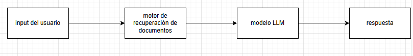
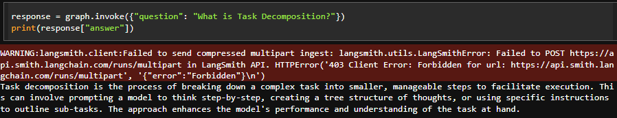
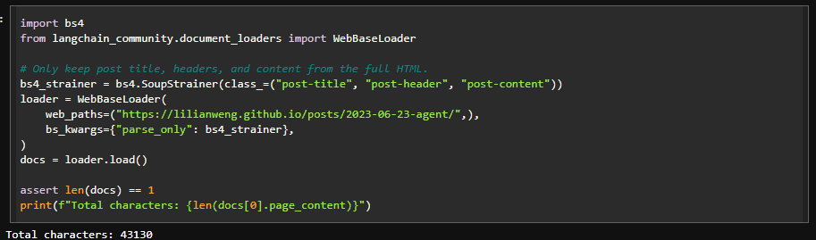
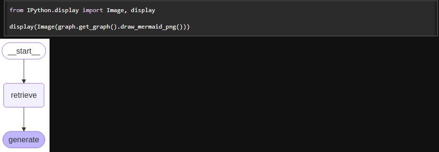
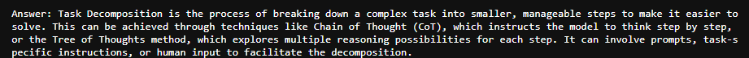
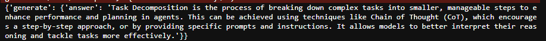
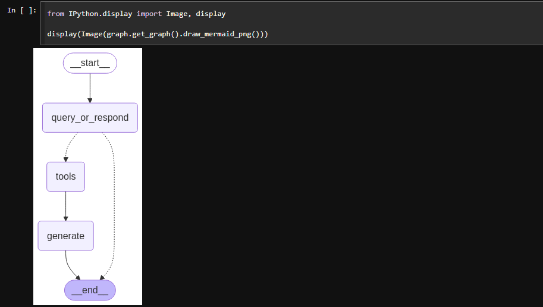

# 🐭 **Taller LLM -  RAG**

El objetivo de esta segunda parte es implementar una arquitectura RAG  utilizando las herramientas de OpenAI y el framework LangChain (https://python.langchain.com/docs/tutorials/rag/).




***Flujo básico de las RAG***

### ♨️ Instalación

1. **Clonar el repositorio** desde GitHub:
   ```bash
   git clone https://github.com/JuanPabl07DP/AREP_Taller8_RAG.git
   ```
2. **Navegar al directorio del proyecto**:
   ```bash
   cd AREP_Taller8_RAG
   ```
3. **Abrir el archivo Jupyter Notebook** para interactuar con el modelo LLM:

   ```bash
   jupyter Copy_of_AREP_Taller8_2.ipynb
   ```

   NOTA: No olvidar colocar la APIKey generada por OpenAI y pinecone.

### 🔥Requisitos

- **Python**.
- **LangChain**: Framework que integra modelos LLM.
- **OpenAI**: API de openAI para poder interactuar con los modelos GPT y de lenguaje.
- **Colab**: Herramienta necesaria para interactuar con el código.

### 😉Pruebas













### 🍄Autor

* **Juan Pablo Daza Pereira** - [JuanPabl07DP](https://github.com/JuanPabl07DP)
